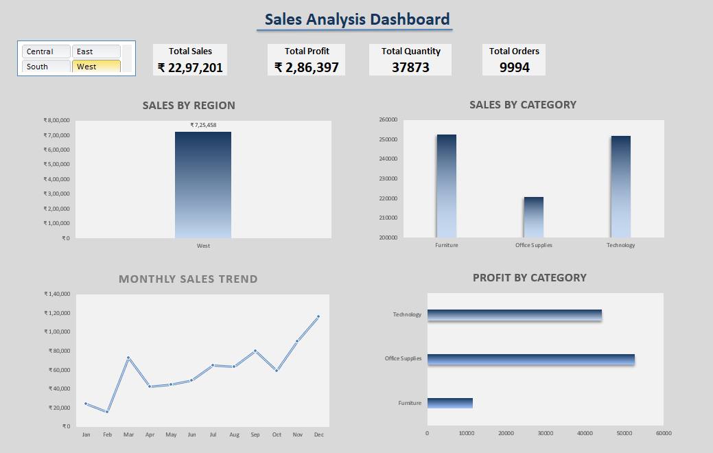

# Excel Sales Analysis Dashboard

## Dashboard Preview

This is my first interactive dashboard built using Microsoft Excel.

## Dataset
Sample Superstore dataset sourced from Kaggle.

## Tools Used
- Pivot Tables
- Pivot Charts
- Slicers
- KPI Cards
- Data Visualization Techniques

## Dashboard Includes
- Sales by Region
- Sales by Category
- Monthly Sales Trend
- Profit by Category
- Interactive Region Filter (Slicer)

## Objective
To analyze regional performance, category contribution, profit distribution, and monthly sales patterns in a clear and visual way.

This project marks the beginning of my journey in data analytics.
